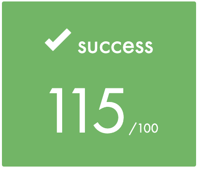

<p align="center">
  <a href="https://42lyon.fr/">
    
  </a>

  <h2 align="center">cub3D</h2>
  <p align="center">
    My first RayCaster with miniLibX
    <br>
    <br>
    This project is inspired by the world-famous Wolfenstein 3D game, which was the first FPS ever. 
    <br>
    It will enable you to explore ray-casting.
    <br>
    <br>
    Graded "Outstanding" project with bonus, multithreading, dangerously cute penguins, crocs, tasty animations and sounds, complex gameplay and homemade textures.
    <br>
    <br>
    :star::star::star::star::star: "Masterfull ! Storytelling at its finest with a breathtaking end." - bestgame.com
    <br>
    <br>
    <a href="./assets/en.subject.pdf">English Subject </a>
    |
    <a href="./assets/fr.subject.pdf"> Sujet en Francais</a>
  </p>
</p>


<p align="center">
    
  </a>


## Table of contents

- [Quick start](#quick-start)
- [What's included](#whats-included)
- [Creators](#creators)

## Quick start

My first big project as I was learning basics of programmation and C. Lot's of fun !

Cub3D with bonus :
  - skybox 
  - multithreading
  - numerous sprites
  - FPS count
  - jump
  - look up and down
  - (duck) sounds 
  - great taste animations :fire:
  - killer crocs :crocodile:
  - homemade textures made with photoshop, my personnal right crocs and my swolo buffed arm :muscle:
  - dangerously cute penguin :penguin:
  - the great penguin tower is watching you ! :eyes:
  - doors
  - Borat ?!?
  - Jurassic Park flute
  - (...)

- Clone repo :
    ```
    git clone https://github.com/llecoq/Cub3d.git
    ```
- Get inside the root of the directory :
    ```
    cd Cub3d
    ```
- Compile mandatory + bonus part
    ```
    make
    ```
- Force clean
    ```
    make fclean
    ```
To run the game, choose the path to a map :
    ```
    ./Cub3D assets/maps/map.cub
    ```

Tweak the parameters to make your own personalized map:
```
C - celling color in RGB
F - floor color in RGB
R - screen resolution in pixels
SO - south wall texture path
WE - west wall texture path
EA - east wall texture path
NO - north wall texture path
S - sprite texture path
```


Inside the game :
```
w - move forward
a - move left
d - move right
s - move backward
```
```
spacebar - jump
keyboard arrows - look around 
left ctrl - get down and be slow
```
```
0 - penguins are gonna try to kill you, give them a taste of your crocs medicine !
e - that giant penguin-eye-tower is invading your private life, what a stalker... Make it BOOOM !
alt - open doors
```
```
print scr - capture an in-game bmp screenshot
```

<p align="center">
    
  </a>

## What's included

```
cub3d
├── Makefile
├── assets
│   ├── en.subject.pdf
│   ├── final grade.png
│   ├── fr.subject.pdf
│   ├── maps
│   │   └── [... epic maps ...]
│   ├── sound
│   │   ├── [... great taste sounds ...]
│   │   └── quack.mp3
│   └── xpm
│       ├── [... homemade textures ...]
│       └── wood.XPM
├── in_game_screenshot.bmp
├── includes
│   ├── cub3d.h
│   ├── minilibx
│   │   └── [... graphic library ...]
│   └── struct.h
├── libft
│   ├── [...]
│   └── libft.h
├── mlx
│   └── libmlx.dylib
└── srcs
    ├── commands
    │   └── [... get your feet moving ...]
    ├── graphic
    │   ├── [... kill them bad boys ...]
    │   └── ray_casting.c
    ├── main.c
    ├── parsing
    │   └── [... boring stuff ...]
    └── utils
        └── [... more boring stuff ...]
```


<p align="center">
    
  </a>

## Creators

**llecoq**

- <https://github.com/llecoq>

